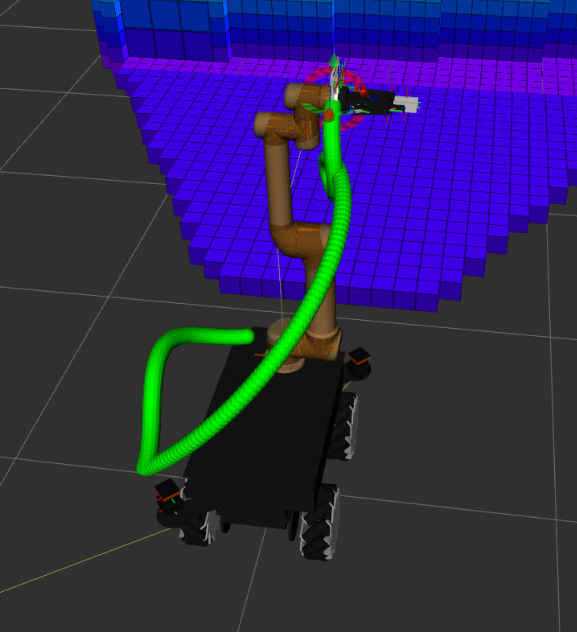

# Visualize the planned MoveIt 2 robot arm trajectory in RViz

**Steps**
1. After cloning, building and sourcing this branch of the repo in your ROS 2 workspace, navigate to the `Displays` panel on the left, then go to `Add > By display type (in rviz2 window) > rviz_default_plugins > MarkerArray > OK`.
2. You will see now the `MarkerArray` in the Displays panel. Then click `MarkerArray` and in `Topic` replace the topic name with `/summit/trajectory/(joint_name)` to visualize its trajectory. For example for `arm_tool0`, it would be `/summit/trajectory/arm_tool0`. 
3. This trajectory would remain for about 2 mins before disappearing (timing is configurable in the ROS message, [here](https://github.com/Gaurav-Kapoor-07/moveit_visual_tools/blob/humble-trajectory-viz/src/moveit_visual_tools.cpp#L1408)). But then you have to build and source this repo again.
4. The trajectory would look like this:

)
